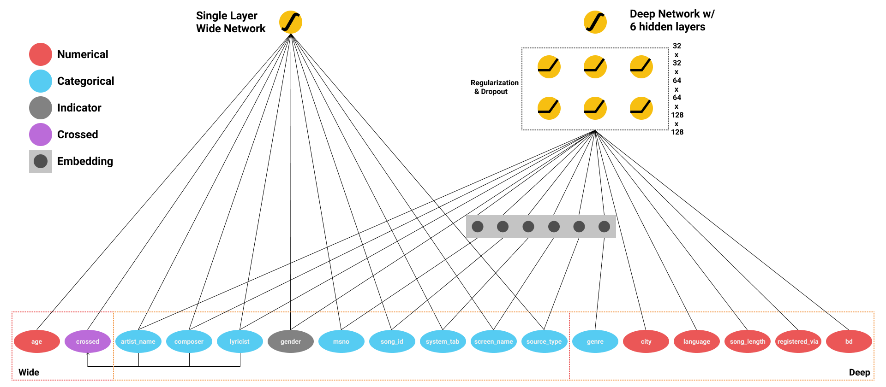

## Introduction

This is the milestone report for Deep Learning student project KKBox Music Recommendation. The milestone report starts with the background and related work, followed by a problem formulation and methods applied. In the end, the preliminary results will be reported together with the scheduled improvements and next phase goals.

## Related Work

### Published Works

We borrowed insights from Google’s research result Wide & Deep Learning for Recommender Systems\[1\]. As will be elaborated in later sections, we applied the structure used in this paper as a benchmark.

Based on this benchmark, we will try to find the best structure for the deep part and wide part of the network for this particular problem. This is based on the public github repository for this paper.

### Open Source Code

Feature engineering is one other critical point for improving performance. In order to kickstart our feature engineering and try to grasp an initial understanding on the structure of data, we borrowed insights from public kernels used in this competition\[2\]\[3\]. Based on these kernels, we developed our new features and found new directions that can better convey useful information to our model, which will be further elaborated in later sections.

We also used well-recognized open kernels as a benchmark\[2\]. In the later part of our project we will compare our networks with the popular models that do not use deep learning techniques, and try to seek insights from the comparisons.

## Problem Formulation

## Problem to Solve

The problem is to recommend music to a user based on a history of the user’s actions, together with limited information of the user and songs.

The model needs to give predictions on whether a user will listen to a song one more time. A floating point number output between 0 and 1 is expected for each testing song-user combination.

### Evaluation

The predictions are evaluated using area under the ROC curve. The public leaderboard shows the ranking based on AUC scores.

As of Nov. 20, the best score is 0.74020 and the 100th competitor has 0.683, which is roughly the separation of top 20%.

## Method Applied

### Wide & Deep Neural Network

We trained a Wide and Deep Learning Network in Tensorflow to predict the recommendation result.

Features in the deep network include the age of users, the city of users, the language of songs and the method in which the users registered, etc. These data is provided in a numerical form by Kaggle. Besides, we also embeded several categorical features and fed them into the deep network so that more complex relationships among the data can be represented in the deep network. Features in the wide network include gender, artist name, composer, lyricist, age buckets, system tab, system name and source type, etc. System related features basically revealed whether users were using local library or an online playlist system when they located the songs. These are all categorical features, and we hashed them with a reasonable hash bucket size using tensorflow API. We also created a crossed feature that combined artists, composers and lyricists and fed it into the wide network because we believe some users will have a strong preference for songs that are produced by specific combination of these three roles.

The deep network has 6 hidden layers, with 128, 128, 64, 64, 32, 32 hidden units in each layer. The wide network is a shallow linear network with just one layer. We also utilized shuffling and batching when training to have a more stochastic training process and to prevent out of memory error.

Architecture Graph:

### Feature Engineering

As introduced, we started our feature engineering from an existing public kernel which already yields accepting results.

The kernel already contains techniques to convert strings to integer categories, filling empty cells, and merging all data tables into one by joining all user and song information to the main table.

The kernel also provides generating new features like how many songs the artist/composer/lyricist has, and how many times this song has been played. The kernel also checks if the music has multiple genres and is featured with other artists. This gave us inspirations to find the main and side artists of the song, and check whether the music is live/acoustic/instrumental etc.

We also found the mean and standard deviation of song lengths, and generated features including how much the song is longer/shorter than the mean.

We discovered that the dataset has a large number of music from East Asia, which means there are a lot of Chinese/Japanese/Korean characters. There are still a lot to do in extracting features from these languages, like including Chinese/Japanese/Korean words while doing string search.

## Preliminary Results

### Benchmark Formation

We chose 2 benchmarks for this project.

The first benchmark is from publicized Kaggle kernels developed for this competition\[2\].

The second benchmark is the Wide & Deep Neural Network that we first trained based on mimicking the structure of its original paper.

### First Benchmark

The first benchmark is an Light Gradient Boosting Machine

We chose this result as the first benchmark due to 2 reasons:

1\. The model is easy to reproduce. It uses Light Gradient Boosting Machine, which is an open source implementation of gradient boosting model. It provides an API that is easy to pick up, where only a set of hyper-parameters are needed to construct the model.

2\. The model produces rather decent results, which is representative of what the Kaggle competitors currently have. The model itself is an ensemble, which should produce decent results even without delicate feature engineering and regularization. After a set of feature engineering operations, this model currently produces an AUC score of 0.68, which is around top 10% in the public leaderboard.

We kept only basic feature engineering techniques to fill empty data cells but removed high-level ensemble with other models. It produced a score of 0.66770, which is roughly 50% of all active competitors. We thought this is a good benchmark for our Neural Network to compare to as a starting point.

### Second Benchmark

The second benchmark is the KKbox Benchmark listed on the Recommendation Challenge leaderboard. It has an accuracy of 0.60643, and one of our goal is to outperform this benchmark with a result generated by a wide and deep neural network.

Currently, the highest score our wide and deep neural network can achieve is 0.61041. We reached this accuracy after training our model for 18 epochs.

## Next Step Improvements

### Feature Engineering

The current feature engineering only covers semantics of English. As KKBox, the publisher of the dataset, is from Taiwan, a large percentage of the music are from East Asia. It follows that a lot of knowledge can be mined from applying Chinese semantics, including searching for Chinese keywords in both traditional and simplified Chinese to generate new features.

The current feature engineer also has space for improvements. For one example, if a song has multiple genres, the genres are concatenated by “|” as separators, which means if two songs have some genres in common, it cannot be recognized as the genres are different strings. If we transform the genre feature to one-hot features, more information can be extracted.

We will also try to cluster the songs based on genres, artists, composers and lyricists and try to extra more higher level knowledge for the model.

### External Data

This competition allows and encourages participants to use external datasets, which brings many possibilities to the improvements.

As far as we know, KKBox has released another set of music data in KKBox’s Churn Prediction Challenge. The relevant data includes when the user chooses to skip the rest of the song when it is playing. Because the data is from the same source as this competition, we think it is very likely that the music sets will match and the dataset will be a meaningful complement to what we currently have.

There are also public music information databases including the extracted and abstracted audio features of songs\[4\]\[5\], which can be a great boost to the information that we are given. If we have the audio features or clips, convolutional neural networks will become feasible and provide us more informative features. However, due to predictable constraints we decided not to integrate them into our dataset until proven feasible. The major problem are song set mismatches and huge dataset sizes. For example, the Million Song Dataset\[4\] contains more than 280G data, which is a huge stress to our resources. Other challenges include an absence of an interface for downloading the whole dataset\[5\]. For model training, it’s very hard to rely on a streaming interface only.

### Neural Network

There are some features that we currently don’t feed into our network, such as song length, song id and genre ids. In our previous training process, we found the large magnitude of song length compared with other numerical features made our model inaccurate. Therefore, we may discretize the song length and turn it into a categorical feature, so that it can fit into our wide network.

As for the deep network, we are trying to find more numerical features to feed into it. And if there are enough relevant features, we believe increasing the hidden units and layers of the deep network can make it represent a more sophiscated relation among features, and thus boost our model’s performance.

## References

\[1\] Cheng, Heng-Tze, et al. “Wide & deep learning for recommender systems.” Proceedings of the 1st Workshop on Deep Learning for Recommender Systems. ACM, 2016.

\[2\] https://www.kaggle.com/asmitavikas/feature-engineered-0-68310

\[3\] https://www.kaggle.com/vinnsvinay/introduction-to-boosting-using-lgbm-lb-0-68357

\[4\] Million Song Database https://labrosa.ee.columbia.edu/millionsong/

\[5\] All Music Database https://www.allmusic.com/faq/topic/download

